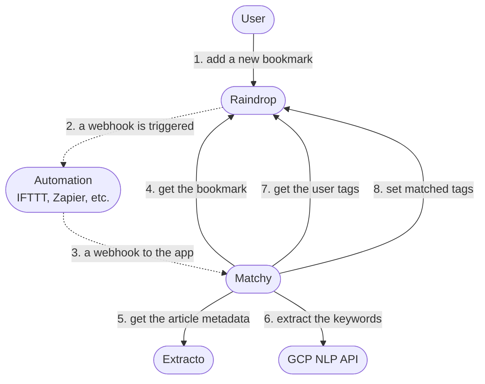

# Matchy

The goal is to automate resource tagging in a read-later system like [Raindrop](https://raindrop.io/).
Usually, users already have a set of tags collected while using the system,
this way it is handy to have a way to add bookmarks with ease while still having a chance to adjust tags later.

There are a few things that should be tackled to make it work:

- Get the article content and the other metadata.
- Extract keywords from the content.
- Match the keywords with the existing tags.

The first step is easy to tackle, there are a few libraries that can help.
The second step is a bit harder, but once again we have some keyword extraction services out there.
The last step is the most challenging among others, but it is also the most important one.
Simple Levenshtein distance won't work well here.

## Overview

## Requirements

### GCP Natural Language API

Hopefully, there is a [GCP Natural Language API](https://cloud.google.com/natural-language/) that can help us with the keyword extraction. It is a paid service, but it is not that expensive. The free tier is enough for this project. Authentication is done via an API key. The API key can be set in the environment variable `GOOGLE_API_KEY`. Check the [Authentication using API keys](https://cloud.google.com/docs/authentication/api-keys#using-with-rest) for more details.

The other way of authentication is via a service account. Check the [Authentication using a service account](https://cloud.google.com/docs/authentication/production#auth-cloud-implicit-go) for more details, but it takes a bit more effort to set up, especially with CI/CD.

### Raindrop API

The Raindrop API is used to get the bookmarks and the tags. The API key can be set in the environment variable `RAINDROP_API_TOKEN`. Check the [Raindrop API documentation](https://developer.raindrop.io/v1/) for more details. Or just generate a test token [here](https://raindrop.io/app/account).
