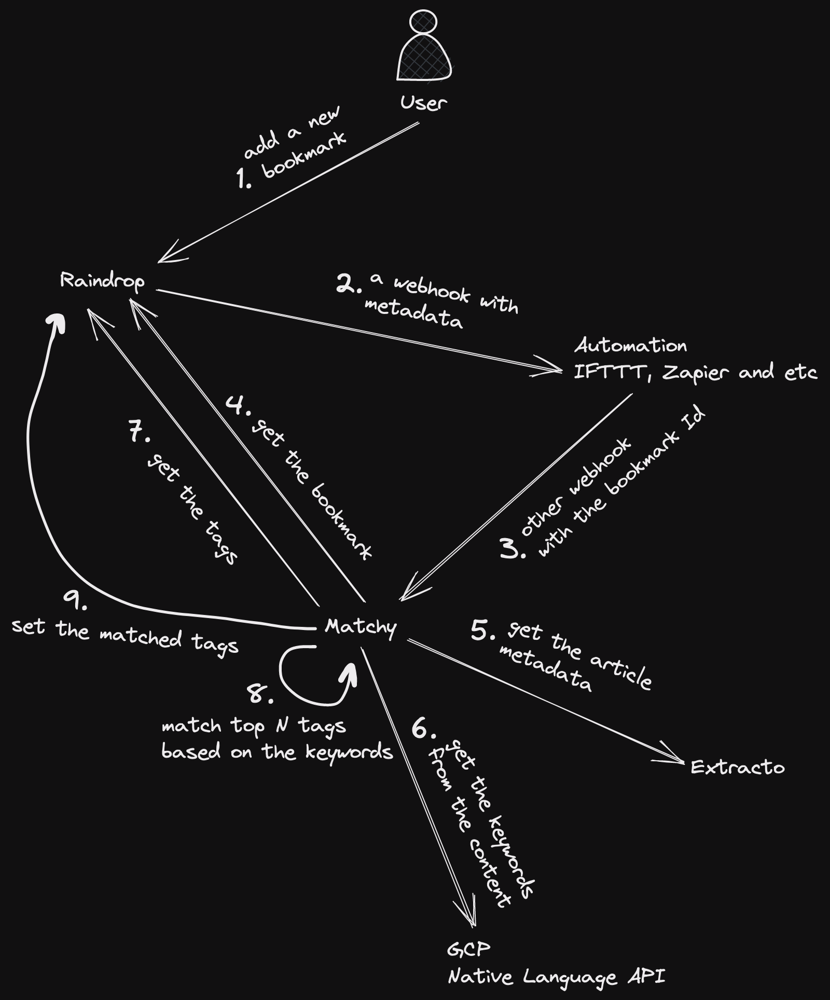

# Matchy

The goal is to automate resource tagging in a read-later system like [Raindrop](https://raindrop.io/). Usually users already have a set of tags collected by using the system, this way it is handy to have a way to add bookmarks with ease while still have a chance to adjust tags later.

There are a few things which should be tackled down to make it works:

- Get the article content and other metadata.
- Extract keywords from the content.
- Match the keywords with the existing tags.

The first step is easy to tackle, there are a few libraries that can help. The second step is a bit harder, but once again we have some keywords extraction services out there. The last step is the most challenging among others, but it is also the most important one. Simple Levenshtein distance won't work well here.

## Overview

